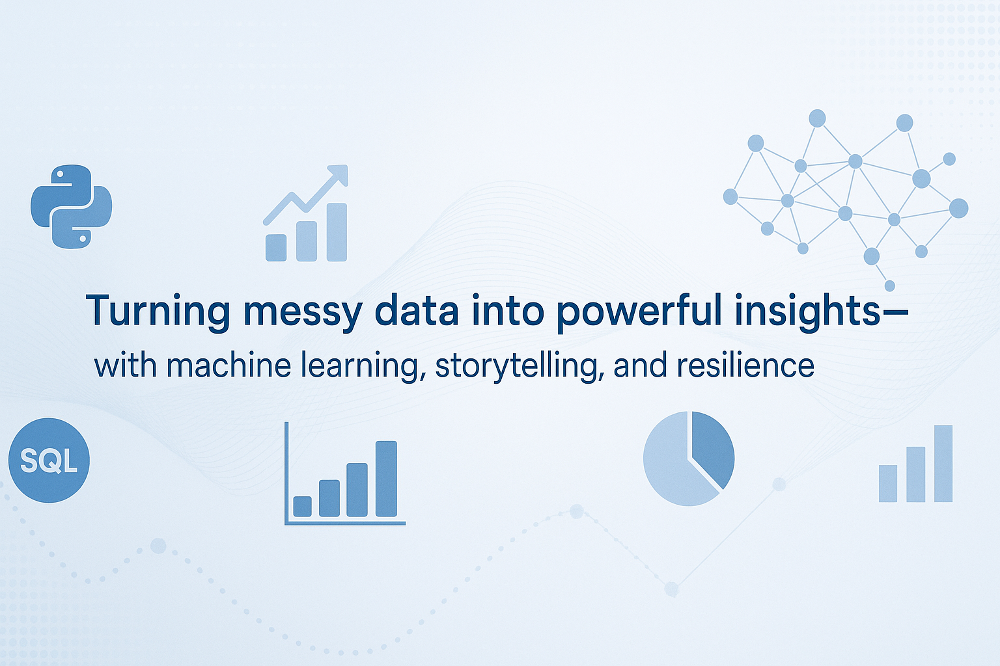

<!-- Banner -->

  

<h1 align="center">Hi, I am Diane Konan 👋</h1>

  Data Scientist | Machine Learning Enthusiast | Business-Minded Problem Solver  

---

## 👩🏽‍💻 About Me

I am a Data Scientist with a Master’s in Data Science from Texas Tech University (4.0 GPA), and a background in Business Computer Information Systems. I thrive on solving real-world problems by combining statistical rigor, machine learning, and storytelling. My portfolio reflects that mission—with end-to-end data science projects rooted in real business challenges across multiple industries.

-  Reduced churn by 30% with predictive modeling
-  Built scalable ETL pipelines in Python and SQL (↓ processing time by 35%)
-  Delivered business dashboards in Tableau & Power BI that boosted decisions across departments

I am passionate about bridging data science and business value with clear, actionable insights.

---

## 🔧 Tools & Technologies

---

## 📂 Featured Projects

###  [Used Car Price Prediction](https://github.com/dmkonan/Used-Car-Price-Prediction) 
Achieved R² of 86.6% with stacked Gradient Boosting + XGBoost; performed extensive feature engineering on messy real-world data.

### [Retail Insights Analytics](https://github.com/dmkonan/Retail_Analytics)
-Sales Performance Analysis: Analyzed sales trends and key drivers using visual analytics and dashboarding techniques.

-Customer Segmentation & Retention: Clustered customers with k-means, applied survival analysis to predict churn, and reduced attrition by 8%.

### [Phishing Email Detection](https://github.com/dmkonan/Phishing-Email-Detection)
Built a text mining and Logistic Regression model using TF-IDF and Scikit-Learn to flag malicious emails and improve email security.

---

## 🤝 Let’s Connect

📫 Email: [dimikonan@gmail.com](mailto:dimikonan@gmail.com)  
🌐 Portfolio: [dmkonan.github.io/Diane-Konan-Portfolio](https://dmkonan.github.io/Diane-Konan-Portfolio)  
🔗 [LinkedIn](https://www.linkedin.com/in/diane-konan)

---

_“Turning complex data into powerful insights—with machine learning, storytelling, and resilience.”_

