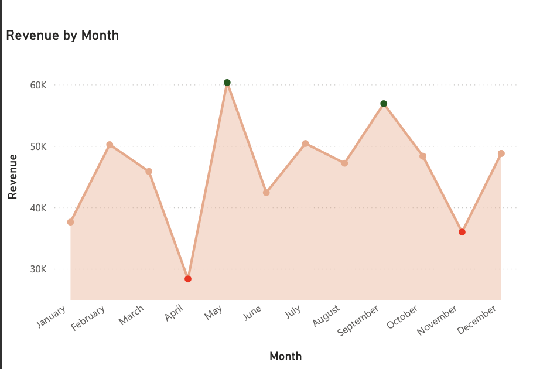
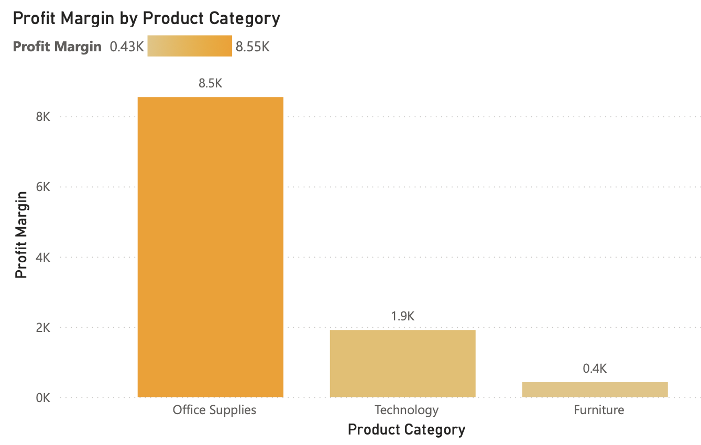
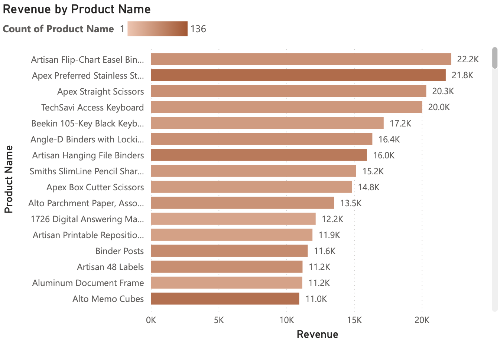
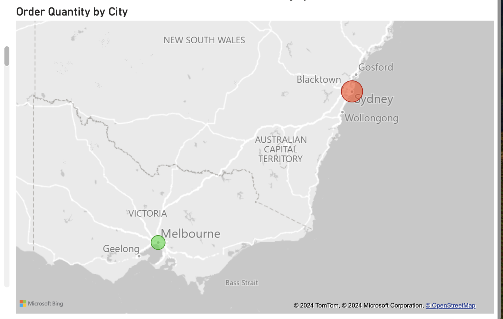
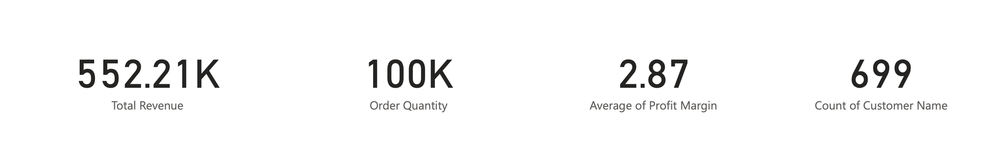
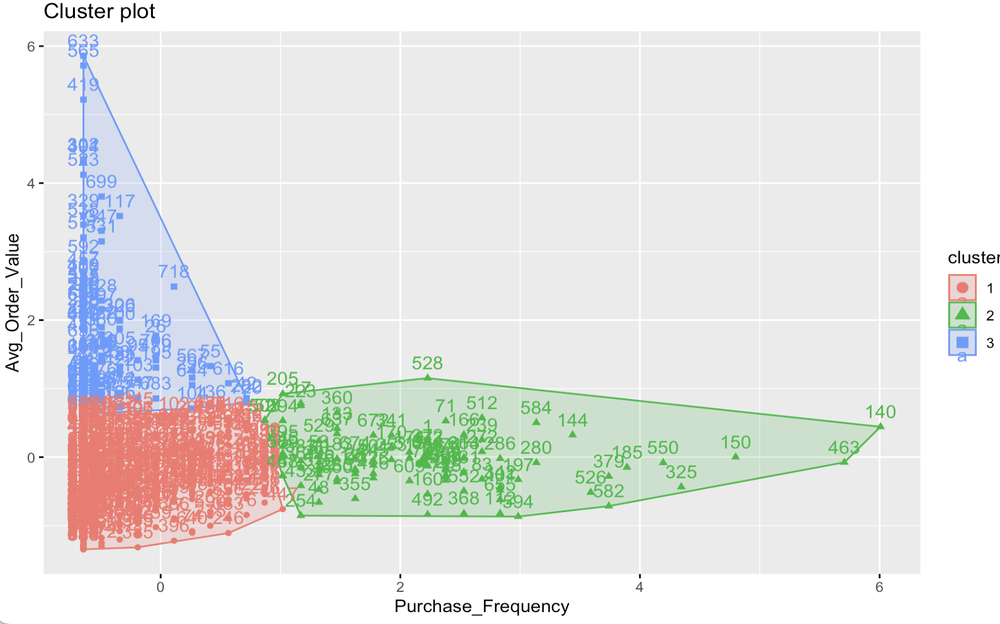

Welcome to my GitHub portfolio! 

# About Me

My name is Diane Konan, I am a passionate Data Scientist in the making. Currently pursuing a Master’s degree in Data Science at Texas Tech University, I aim to graduate in May 2025. I am also a part-time Data Analyst at Inter Tax Solutions, a small business specializing in tax consulting.

With a strong foundation in data analytics and programming, I focus on extracting meaningful insights from data and applying cutting-edge techniques to solve real-world problems.

# Featured Projects

**Sales Performance Analysis**

**Customer Segmentation and Retention Analysis**


# Project 1 : Sales Performance Analysis

**Dataset:** Retail Insights: A Comprehensive Sales Dataset

**Source:** Kaggle

**Link:** [https://www.kaggle.com/datasets/rajneesh231/retail-insights-a-comprehensive-sales-dataset/data](https://www.kaggle.com/datasets/rajneesh231/retail-insights-a-comprehensive-sales-dataset/data)

# Objective
The objective of this project is to analyze sales performance and gain actionable insights into revenue trends, profit margins, product performance, and order distribution across locations. The analysis provides a foundation for improving business strategy, optimizing product offerings, and tailoring marketing initiatives.

# Data Cleaning and Preparation
The dataset contains sales transactions from a retail company, including details about orders, customers, products, pricing, and shipping. Python's Pandas library was used to clean and analyze the data.

**1. Handling Missing Values:**
A check for missing values was conducted using the following function:
```python
# Check null values
sales_df.isnull().any()
```
A critical missing value was identified in the Order Quantity column. Imputation was used to fill this gap:
```python
# Replace the Order Quantity missing value with the column mean
sales_df['Order Quantity'] = sales_df['Order Quantity'].fillna(sales_df['Order Quantity'].mean())
```

**2. Ensuring Data Consistency:**
The data types of all variables were verified to ensure consistency before performing calculations. For instance, date-related columns were converted to a datetime format:
```python
# Modify the Date column to a datetime data type to ensure consistency
sales_df['Order Date'] = pd.to_datetime(sales_df['Order Date'], dayfirst = True)
sales_df['Ship Date'] = pd.to_datetime(sales_df['Ship Date'], dayfirst = True)
```

**3. Outlier Detection and Removal:**
Outliers were identified and removed to prevent them from distorting the analysis. Summary statistics were inspected using the describe() function, revealing significant differences between the mean and median, as well as the minimum and maximum values. This indicates the presence of outliers primarily due to bulk orders that are unlikely to recur. Outlier removal was performed as follows:
```python
# Specify the columns to check for outliers
columns_to_check = ['Cost Price', 'Retail Price', 'Profit Margin', 'Sub Total', 'Discount $', 'Order Total', 'Total']
# Calculate Q1, Q3, and IQR for the specified columns
Q1 = sales_df[columns_to_check].quantile(0.25)
Q3 = sales_df[columns_to_check].quantile(0.75)
IQR = Q3 - Q1

# Define outliers bound
lower_bound = Q1 - 1.5 * IQR
upper_bound = Q3 + 1.5 * IQR

# Filter out outliers
filtered_sales = sales_df[~((sales_df[columns_to_check] < lower_bound) | (sales_df[columns_to_check] > upper_bound)).any(axis=1)].copy()
```
**4.Exporting Cleaned Data:**
After sorting and re-indexing the dataset, the cleaned data was exported using the to_csv() function for visualization in Power BI.

**Note:** The complete Python code for data cleaning is available [here.](SalesData_Cleaning.ipynb)

---

# Data Visualization and Analysis 
The company specialized in Office Supplies, Technology and Furniture sales.

 **Revenue by Month**  
 
- **Trend Observed**:  
  Revenue fluctuates across the year, peaking in certain months such as **May, September, and December**, with the highest revenue in **May**. Months like **January, April and November** show lower revenue levels.  

- **Insights**:  
  - The peak revenue in May could be linked to the fact that many companies often initiate fiscal year-end preparations or begin new projects around this time, leading to bulk purchases of office supplies and technological upgrades.
  - For the September's peak, it is a month that marks the beginning of the academic year, driving demand for office supplies, laptops, printers, and other tech essentials.
  - April's low revenue might indicate a lack significant events or seasonal triggers (like back-to-school or holiday shopping), making it a low-priority month for office and tech-related purchases.
  - Office supplies may see reduced demand in November as businesses and schools wind down operations for the year-end.

- **Recommendations**:  
  - Focus on increasing promotional activities during off-peak months to drive sales.
  - Prepare well for high-performing months with adequate inventory and marketing campaigns.

---

 **Profit Margin by Product Category**  
 
- **Key Findings**:  
  - **Office Supplies** contributes the highest profit margin, approximately **8.5K**, far surpassing other categories.
  - **Technology** generate a modest margin (~1.9K), while **Furniture** has the lowest margin (~0.4K).

- **Insights**:  
  - Office Supplies are the primary revenue and profit drivers.
  - The Technology lower margin might be caused by highly competitive pricing or higher acquisition costs.
  - Furniture’s minimal profit margin could indicate inefficiencies in cost management or pricing strategies.

- **Recommendations**:  
  - Focus on sustaining and growing the success of Office Supplies by ensuring adequate stock and creating targeted promotional campaigns.
  - Explore opportunities to improve the profitability of Technology products, such as negotiating better supplier terms or adjusting pricing strategies.
  - Conduct a detailed cost analysis of Furniture products to identify inefficiencies and adjust pricing or sourcing to increase margins.

---

**Revenue by Product Name**  

- **Key Observations**:  
  - The top-performing products include **Artisan Flip-Chart Easel Binder (22.2K)**, **Apex Preferred Stainless Steel Scissors (21.8K)**, and **Apex Straight Scissors (20.3K)**.
  - Revenue declines significantly for products ranked lower in the list with the least performing products generating **0.0K** (See interacive dashboard [here.](Retail_data_Visualization-2.pbix)

- **Insights**:  
  - A few products are driving most of the revenue, indicating reliance on a limited set of items.
  - Lesser-performing products may need reassessment of their market fit or visibility.

- **Recommendations**:  
  - Strengthen marketing for high-revenue products to maximize sales.
  - Analyze low-revenue products, especially those generating 0.0K revenue, for potential discontinuation or improvement.

---

**Order Quantity by City** (Map Visualization) 

- **Findings**:  
  - Order quantities vary across cities, with Sydney likely having significantly higher activity than Melbourne.
  - Cities with higher order quantities might correspond to locations with larger populations or active customer bases.

- **Insights**:  
  - The city of Sydney is outperforming Melbourne, suggesting disparities in customer base or regional demand.

- **Recommendations**:  
  - Allocate resources to high-performing regions to sustain growth.
  - Explore targeted campaigns or new opportunities in underperforming cities to expand market reach.

---

**Summary Metrics**  

- **Insights**:  
  - The average profit margin is relatively low, indicating possible areas for efficiency improvement.
  - A total customer count of 699 indicates opportunities to expand the customer base through improved marketing.

- **Recommendations**:  
  - Optimize cost structures to improve profit margins.
  - Invest in customer acquisition and retention strategies to grow the customer base.

---

# Project 2: Customer Segmentation and Retention Analysis

# Objective
The objective of this project is to perform customer segmentation by analyzing the previous sales data. This segmentation provides insights into customer behavior and preferences, enabling targeted marketing strategies, personalized offerings, and improved customer retention.

---
To perform customer segmentation and retention analysis, I am clustering customers based on key metrics:

**Purchase Frequency:** Number of purchases made by each customer.

**Average Order Value:** Average amount spent per order.


**1. Data Preparation:**
I will aggregate data at the customer level to compute each customer’s purchase frequency and average order value:
```r
# Aggregate data by Customer Name to compute purchase frequency, average order value, and region (assuming 'State' as region)
customer_data <- sales_data %>%
  group_by(Customer.Name, State) %>%
  summarise(
    Purchase_Frequency = n(),
    Avg_Order_Value = mean(Total)
  )
```
**2. Clustering:**
Using k-means clustering, I will group customers based on these characteristics:
```r
 Perform K-means clustering (assuming 3 clusters as a start)
set.seed(123)
kmeans_result <- kmeans(customer_data_scaled, centers = 3)

# Add cluster information to the dataset
customer_data$Cluster <- as.factor(kmeans_result$cluster)
```

**3. Interpretation:**


- **Clusters Characteristics:**
  - **Cluster 1 (Red):** Low purchase frequency and low average order value. These customers might be one-time or infrequent buyers with lower spending.
  - **Cluster 2 (Green):** Higher purchase frequency and medium average order value. This group may consist of regular but not heavy spenders.
  - **Cluster 3 (Blue):** Medium purchase frequency and higher average order value, suggesting loyal, high-value customers.

- **Targeted Strategies:**
  - **Cluster 1 (Red):** Focus on re-engagement strategies, such as sending targeted discounts or reminders to encourage repeat purchases.
  - **Cluster 2 (Green):** Provide loyalty incentives to increase their average order value, like rewards programs.
  - **Cluster 3 (Blue):** Focus on retention by offering exclusive benefits or early access to products to maintain their loyalty.

  **Note:** Complete R Code [here.](Sales_Data_Clustering.R)
---
# Connect

📫 Email: dimikonan@gmail.com

💼 LinkedIn: [https://www.linkedin.com/in/diane-konan](https://www.linkedin.com/in/diane-konan)

Thank you for visiting my portfolio! Feel free to explore my projects and reach out for collaborations, feedback, or questions. 

